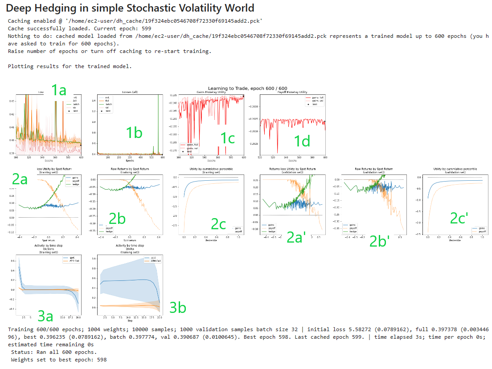

# Deep Hedging
## Reinforcement Learning for Hedging Derviatives under Market Frictions

This archive contains a sample implementation of of the [Deep Hedging framework](http://deep-hedging.com). The purpose of the code base is to illustrate the concepts behind Deep Hedging. The code is not optimized for speed. Any production use will require additional safeguards before use.

The notebook directory has a number of examples on how to use it. 

### Latest major updates:
* **Enabled caching** (Jan 8th, 2023): by default, the code now caches progress every 10 epochs. Training will be picked up at the last caching point when the same code is re-run. If training completed, running the same code again will not trigger new training; you can set `config.train.caching.mode = 'update'`.

* **Recurrent Agents** (Jan 8th, 2023): the trading agent can now pass on a state from one step to another, allowing it full recurrence. Enable it with `config.gym.agent.recurrence =  r`, where `r` denotes the number of real numbers the agent may pass from one step
to the next.

_Beta version. Please report any issues. Please see installation support below._

### Deep Hedging

The Deep Hedging problem for a horizon $T$ hedged over $M$ time steps with $N$ hedging instruments is finding an optimal *action* function $a$ as a function of feature states $s_0,\ldots,s_{T-1}$ which solves

$$
 \sup_a:\ \mathrm{E}\left[\ 
    Z_T + \sum_{t=0}^{T-1} a(s_t) DH_t + \gamma_t  | a(s_t) |
 \ \right] \ .
$$

Here
* $s_t$ is the *state* of the market; in other words it is a vector of $t$-observable variables which are fed as parameters into our action network $a$.
* $DH_t:=H_{T'} - H_t$ denotes the vector of returns of the $M$ hedging instruments $H$ available at $t$ from $t$ to our maximum expiry $T'>=T$. The expiry time $T'$ is set such that all hedging instruments are expired by that time.

    * If the $i$<b></b>th hedging instrument is spot $S$, then  $DH^{i}_t = S_T - S_t$ is simply the return of the equity from $t$ to $T$.
    * If the $i$<b></b>th instrument is an option $X$ with expiry $\tau$ then in the current implementation uses $DH^{i}_t = X_\tau - V_t$ where $V$ is the market price at $t$ and where $X_\tau$ is the option's payoff at maturity. The maturity $T'$ is the maximum off all maturities of all hedging instruments.

* $\gamma_t$ represents the vector of proportional transaction cost.
* $U$ is a _monetary utility_ which can be thought of as a risk-adjusted return.
A classic example is the entropy, given by $U(X) := - \frac1\lambda \log\ \mathrm{E}\left[\ \exp(-\lambda X) \right] $. The code base supports a number of utility-based monetary utilities which can be found in the
file `objectives.py`.

To test the code run `notebooks/trainer.ipynb`.

In order to run the Deep Hedging, we require:

* __Market data__: this is referred to as a `world`. The sample code provides a simplistic default implementation: a simple Black & Scholes world, and a made up stochastic volatility world. The notebook `notebooks/simpleWorld_Spot_ATM.ipynb` provides some visualization.        
        For any real application it is recommend to rely on fully machine learned market simulators, c.f. https://arxiv.org/abs/2112.06823.

    A `world` class contains a number of members. The most important are

    * `tf_data` member which contains

        * `tf_data['features']['market']`: core market data for the simulator. These are _not_ passed as features $s_t$ to the action model, because some of them such as $DH_t$ are forward looking.

        * `tf_data['features']['per_step']`: features per time step $t$, e.g. current equity spot, prices for out options, time left, implied vol, values of the boundaries for actions.
        * `tf_data['features']['per_path']`: features per sample path. These are currently none as we are training for fixed instruments, but this can be extended accordingly.

        Note that the actual features $s_t$ available for training are a combination of the above and live features. To obtain a list of supported features, call

        * `VanillaDeepHedgingGym.available_features_per_step` for the features available per time step, i.e. $s_t$ in above formulation. Call `agent_features_used` to assess which features were actually used by the agent.

        * `VanillaDeepHedgingGym.available_features_per_path` for the features available per sample path step. This is a subset of $s_0$. This is used for the OCE monetary utilities. Call `utilitiy_features_used` to assess which features were actually used.

    * `tf_sample_weights` the probability distribution across samples. If you compute any summary statisics, do not forget to refer to this distribution. As an example `base.py`
    contains a number of basic stats functions such as `mean` and `std` which do not assume a uniform distribution.
    

* __Gym__: the main Keras custom model. It is a Monte Carlo loop arund the actual underlying `agent.py` networks which represents $a$ in the formula above. Given a `world` object we may compute the loss given the prevailing action network as `gym(world.tf_data)`.

* __Train__: some cosmetics around `keras.fit()` with some nice live visualization of our training progress using matplotlib if you are in jupyter. See discussion below.

To provide your own world with real or simulator data, see `world.py`.
Here are `world.tf_data` entries used by `gym.call()`:

* `data['market']['payoff']` `(:,)`
    The payoff $Z_T$ at maturity. Since this is at the time of the expiry of the product, this can be computed off the path until $T$. No derivative pricing model is required.

* `data['martket']['hedges']` `(:,M,N)`
    Returns of the hedges, i.e. the vector $DH_t:=H_{T'} - H_t$ for each time step. That means $H_t$ is the market price at time $t$, and $H_{T'}$ is payoff of the instrument at its expiry. In our examples we expand the timeline such that the expiry of all products is part of the market simulator. 

    For example, if $S_t$ is spot, $w_t^{(i)}$ is the option's implied volatility at $t$,  $x$ its time-to-maturity, and $k$ a relative strike, then
$$
    H_t^{(i,t)} = \mathrm{BSCall}( S_t, w^{(i)}_t; T, kS_t ) \ \ \ \mathrm{and} \ \ \ H_{T'}^{(i,t)} = ( S_{t+x} - kS_t )^+
$$

* `data['martket']['cost']` `(:,M,N)`

    Cost $\gamma_t$ of trading the hedges in $t$ for proportional cost $c_t(a) = \gamma_t\cdot |a|$. 
    More advanced implementations allow to pass the cost function itself as a tensorflow model.
    In the simple setting an example for the cost of trading a vanilla call could be $\gamma_t = \gamma^D\, \Delta(t,\cdots)+ \gamma^V\,\mathrm{BSVega}(t,\cdots)$.

* `data['martket']['unbd_a'], data['martket']['lnbd_a']` `(:,M,N)`

   min/max allowed action (change of delta) per time step: $a^\mathrm{min}_t \leq a \leq a^\mathrm{max}_t$, componenwise. Note that the min/max values can be path dependent. In the current implementation they will not depend on dynamic states (such as the current position in hedges), but this can be added if required.

* *`data['features']['per_step']` `(:,M,N)`

    Featues for feeding the action network per time step such as current spot, current implied volatilities, time of the day, etc. Those will be added to the state vector $s_t$.

* `data['features']['per_sample']` 1(:,M)`
    Featues for feeding the action network which are constant along the path such as features of the payoff, risk aversion, etc. This is not used in any of the current examples, but it will allow you to train the model for different payoffs at the same time:

    * Define different option payoffs $Z_T$ per path
    * Enure that the characteristic of the option payoff are part of the `per_sample` feature set, and that they are picked up by the respective network agent.

An example world generator for simplistic model dynamics is provided, but in practise it is recommend to rely
on fully machine learned market simulators such as https://arxiv.org/abs/2112.06823

## Installation

See `requirements.txt` for latest version requirements. At the time of writing this markdown file:
* Use Python 3.7 or later
* Pip (or conda) install `cdxbasics` version 0.2.9 or higher
* Install TensorFlow 2.7 or higher
* Install tensorflow_probability 0.15 or higher, c.f. https://anaconda.org/conda-forge/tensorflow-probability
* Download this git directory in your Python path such that `import deephedging.world` works.
* Open `notebooks/trainer.ipynb` and run it. 

See below for more comments on installation, and on using AWS and GPUs.

## Industrial Machine Learning Code Philosophy

We attempted to provide a base for industrial code development.
* **Notebook-free**: all code can, and is meant to, run outside a jupyter notebook. Notebooks are good for playing around but should not feature in any production environment. Notebooks are used for demonstration only.

* **Config-driven built**:
        avoids differences between training and inference code. In both cases, the respective model hierarchy is built
        driven by the structure of the config file. There is no need to know for inference which sub-models where used during training within the overall model hierarchy.          

* **Robust configs**  all configurations of all objects are driven by dictionaries.
    However, the use of simple dictionaries leads to a number of inefficiencies which can slow down development.
    We therefore use [`cdxbasics.config.Config`](https://github.com/hansbuehler/cdxbasics) which provides:
    
    * **Automatic cast'ing and basic range checks**: apply basic checks upon reading parameters from a `config`, for example

            from cdxbasics.config import Config, Int, Float
            def create_agent( config : Config ):
                style    = config("style", "fast_forward", ['fast_forward', 'recurrent', 'iterative'], "Network style")
                smooth   = config("smooth", 0.1, (Float > 0.) & (Float <= 1.), "Smoothing factor")
                width    = config.network("width",  20, Int>0,  "Width of the network")
                depth    = config.network("depth",  3,  Int>0,  "Depth of the network")
                config.done()
                
    *  **Self-documentation**: once parsed by receving code, the config is self-documenting and is able to print out any values used, including those which were not set by the users when calling the receiving code.

            config = Config()
            config.style = "recurrent"
            config.network.width = 100                
            create_agent( config ) 
            print( config.usage_report(with_cast=True) )    

        yields

            config.network['depth'] = 3 # (int>0) Depth of the network; default: 3
            config.network['width'] = 100 # (int>0) Width of the network; default: 20
            config['smooth'] = 0.1 # (float>0.0 and float<=1.0) Smoothing factor; default: 0.1
            config['style'] = recurrent # ([ fast_forward, recurrent, iterative ]) Network style; default: fast_forward

    * **Catching spelling Errors**: ensures that any config parameter is understood by the receving code. Here is what happens if we misspell `width` in our previous example:

            config = Config()
            config.style = "recurrent"
            config.network.witdh = 100
                
            create_agent( config ) 
            print( config.usage_report(with_cast=True) )  

        prodcues

            Error closing 'config.network': the following config arguments were not read: ['witdh']

            Summary of all variables read from this object:
            config.network['depth'] = 3 # Depth of the network; default: 3
            config.network['width'] = 20 # Width of the network; default: 20
            # 
            config['smooth'] = 0.1 # Smoothing factor; default: 0.1
            config['style'] = recurrent # Network style; default: fast_forward

    * **Unique Identifiers**: `Config` objects can produce a `unique_id()` which identifies the 
        specific configuration uniquely. This can be used as key for caching strategies.

    * **Object notation**: we prefer using one-line member notation `config.network.nSamples = 2` instead of the standard dictionary notation `config['network'] = dict(nSamples = 2)`.

        

* **Defensive programming**: validate as many inputs to functions as reasonable with clear, actionable, context-dependent error messages. We use the `cdxbasics.logger` framework with a similar usage paradigm as C++ `ASSSERT`/`VERIFY`.

## Key Objects and Functions

*  **world.SimpleWorld_Spot_ATM** class

    Simple World with either plan Black & Scholes dynamics, or with one asset and one floating ATM option. The asset has stochastic volatility, and a mean-reverting drift. The implied volatility of the asset is not the realized volatility, allowing to re-create some results from https://arxiv.org/abs/2103.11948 

    * Set the `black_scholes` boolean config flag to `True` to turn the world into a simple Black & Scholes world, with no traded option.
    * Use `no_stoch_vol` to turn off stochastic vol, and `no_stoch_drift` to turn off the stochastic mean reverting drift of the asset.
    If both are True, then the market is Black & Scholes, but the option can still be traded for hedging.

    See `notebooks/simpleWorld_Spot_ATM.ipynb`
    
*  **gym.VanillaDeepHedgingGym**  class

    Main Deep Hedging training gym (the Monte Carlo). It will create internally the agent network and the monetary utility $U$ (practically, it will also compute the monetary utility for the playoff alone at the same time).
    
    To run the models for all samples of a given `world` use `r = gym(world.tf_data)`.
    The returned dictionary contains the following members
    
    * `utility (:,)` primary objective to maximize, per path.
    * `utility0 (:,)` objective without hedging, per path. `utility0` also needs to be learned if an OCE monetary utility is used
    * `loss (:,)` the loss `-utility-utility0` per path.
    * `payoff (:,)` terminal payoff per path.
    * `pnl (:,)` mid-price pnl of trading (e.g. ex cost) per path.
    * `cost (:,)` aggregate cost of trading per path.
    * `gains (:,)` total gains: `payoff + pnl - cost` per path. 
    * `actions (:,M,N)` actions taken, per step, per path, $M$ steps and $N$ instruments.
    * `deltas (:,M,N)` deltas, per step, per path: `deltas = np.cumsum(actions,axis=1)`.
    
   The core loop in `VanillaDeepHedgingGym.call()` is only about 200 lines of code. It is recommended to read it before using the framework.

*  **trainer.train()**  function

    Main Deep Hedging training engine (stochastic gradient descent). 
    Trains the model using Keras. Any optimizer supported by Keras might be used. When run in a Jupyer notebook the model will dynamically plot progress in a number of live updating graphs.
    * When training outside jupyer, set `config.train.monitor_type = "none"` (or write your own).
    * See `notebooks/trainer.ipynb` as an example.
    * The `train()` function is barely 50 lines. It is recommended to read it before using the framework.
    
       
    

## Interpreting Progress Graphs

Here is an example of progress information printed by  `NotebookMonitor`:

The graphs show:

* (1): visualizing convergence
    
    * (1a): last 100 epochs loss view on convergence: initial loss, full training set loss with std error, batch loss, validation loss, and the running best fit.
    
    * (1b): loss across all epochs, same metrics as above.
    
    * (1c): learned utility for the hedged payoff, last 100 epochs.
    
    * (1c): learned utility for the unhedged payoff, last 100 epochs.
    
* (2) visualizing the result on the training set:
    
    * (2a) for the training set shows the payoff as function of terminal spot, the hedge, and the overall gains i.e. payoff plus hedge less cost. Each of these is computed less their monetary utility, hence you are comparing terminal payoffs which have the same initial monetary utility.

        Note that visualizing terminal payoffs makes sense for European payoffs, but is a lot less intuitive for more exotic payoffs.

    * (2b) similar to (2a), but without subtracting the monetary utility.

    * (2c) shows the utility for payoff and gains by percentile for the training set. Higher is better; the algorithm
    is attempting to beat the total expected utility which is the left most percentile. In the example we see that the gains process dominates the initial payoff in all percentiles.
    
    * (2a', 2b', 2c') are the same graphs but for the validation set 
    
* (3) visualizes actions:
    
    * (3a) shows  actions per time step: blue the spot, and orange the option.
    * (3b) shows the aggregated action as deltas accross time steps. Note that the concept of "delta" only makes sense if the instrument is actually the same per time step, e.g. spot of an stock price. For floating options this is not a particularly meaningful concept.
        
    

    

## Running Deep Hedging

Copied from `notebooks/trainer.ipynb`:

    print("Deep Hedging AI says hello  ... ", end='')
    from cdxbasics.config import Config
    from deephedging.trainer import train
    from deephedging.gym import VanillaDeepHedgingGym
    from deephedging.world import SimpleWorld_Spot_ATM

    from IPython.display import display, Markdown

    # see print of the config below for numerous options
    config = Config()
    # world
    config.world.samples = 10000
    config.world.steps = 20
    config.world.black_scholes = True
    # gym
    config.gym.objective.utility = "cvar"
    config.gym.objective.lmbda = 10.
    config.gym.agent.network.depth = 3
    config.gym.agent.network.activation = "softplus"
    # trainer
    config.trainer.train.batch_size = None
    config.trainer.train.epochs = 400
    config.trainer.visual.epoch_refresh = 1
    config.trainer.visual.time_refresh = 10
    config.trainer.visual.confidence_pcnt_lo = 0.25
    config.trainer.visual.confidence_pcnt_hi = 0.75

    display(Markdown("## Deep Hedging in a Black \& Scholes World"))

    # create world
    world      = SimpleWorld_Spot_ATM( config.world ) # training set
    val_world  = world.clone(samples=1000)            # validation set

    # create training environment
    gym = VanillaDeepHedgingGym( config.gym )

    # create training environment
    train( gym=gym, world=world, val_world=val_world, config=config.trainer )

    # read result of trained model
    r = gym(world.tf_data)
    print("Keys of the dictionary returned by the gym: ", r.keys())

    print("=========================================")
    print("Config usage report")
    print("=========================================")
    print( config.usage_report() )
    config.done()
    ## Config Parameters

Below is the output of the `print( config.usage_report() )` call above. It provides a summary of all config values available, their defaults, and what values where used.

    =========================================
    Config usage report
    =========================================
    config.gym.agent.network['activation'] = softplus # Network activation function; default: relu
    config.gym.agent.network['depth'] = 3 # Network depth; default: 3
    config.gym.agent.network['final_activation'] = linear # Network activation function for the last layer; default: linear
    config.gym.agent.network['width'] = 20 # Network width; default: 20
    config.gym.agent.network['zero_model'] = False # Create a model with zero initial value, but randomized initial gradients; default: False
    config.gym.agent['agent_type'] = feed_forward # Which network agent type to use; default: feed_forward
    config.gym.agent['features'] = ['price', 'delta', 'time_left'] # Named features for the agent to use; default: ['price', 'delta', 'time_left']
    config.gym.agent['recurrence'] = 0 # Number of recurrent states. Set to zero to turn off recurrence; default: 0
    config.gym.environment['hard_clip'] = False # Use min/max instread of soft clip for limiting actions by their bounds; default: False
    config.gym.environment['outer_clip'] = True # Apply a hard clip 'outer_clip_cut_off' times the boundaries; default: True
    config.gym.environment['outer_clip_cut_off'] = 100.0 # Multiplier on bounds for outer_clip; default: 100.0
    config.gym.environment['softclip_hinge_softness'] = 1.0 # Specifies softness of bounding actions between lbnd_a and ubnd_a; default: 1.0
    config.gym.objective.y.network['activation'] = relu # Network activation function; default: relu
    config.gym.objective.y.network['depth'] = 3 # Network depth; default: 3
    config.gym.objective.y.network['final_activation'] = linear # Network activation function for the last layer; default: linear
    config.gym.objective.y.network['width'] = 20 # Network width; default: 20
    config.gym.objective.y.network['zero_model'] = False # Create a model with zero initial value, but randomized initial gradients; default: False
    config.gym.objective.y['features'] = [] # Path-wise features used to define 'y'. If left empty, then 'y' becomes a simple variable; default: []
    config.gym.objective['lmbda'] = 10.0 # Risk aversion; default: 1.0
    config.gym.objective['utility'] = cvar # Type of monetary utility; default: exp2
    config.gym.tensorflow['seed'] = 423423423 # Set tensor random seed. Leave to None if not desired; default: 423423423
    config.trainer.caching['directory'] = ~/dh_cache # If specified, will use the directory to store a persistence file for the model; default: ~/dh_cache
    config.trainer.caching['epoch_freq'] = 10 # How often to cache results, in number of epochs; default: 10
    config.trainer.caching['mode'] = on # Caching strategy: 'on' for standard caching; 'off' to turn off; 'update' to overwrite any existing cache; 'clear' to clear existing caches; 'readonly' to read existing caches but not write new ones; default: on
    config.trainer.train.tensor_board['hist_freq'] = 1 # Specify tensor board log frequency; default: 1
    config.trainer.train.tensor_board['log_dir'] =  # Specify tensor board log directory
    config.trainer.train['batch_size'] = None # Batch size; default: None
    config.trainer.train['epochs'] = 400 # Epochs; default: 100
    config.trainer.train['learing_rate'] = None # Manually set the learning rate of the optimizer; default: None
    config.trainer.train['optimizer'] = RMSprop # Optimizer; default: RMSprop
    config.trainer.train['run_eagerly'] = False # Keras model run_eagerly. Turn to True for debugging. This slows down training. Use None for default; default: False
    config.trainer.train['time_out'] = None # Timeout in seconds. None for no timeout; default: None
    config.trainer.visual.fig['col_nums'] = 6 # Number of columbs; default: 6
    config.trainer.visual.fig['col_size'] = 5 # Plot size of a column; default: 5
    config.trainer.visual.fig['row_size'] = 5 # Plot size of a row; default: 5
    config.trainer.visual['bins'] = 200 # How many x to plot; default: 200
    config.trainer.visual['confidence_pcnt_hi'] = 0.75 # Upper percentile for confidence intervals; default: 0.5
    config.trainer.visual['confidence_pcnt_lo'] = 0.25 # Lower percentile for confidence intervals; default: 0.5
    config.trainer.visual['epoch_refresh'] = 1 # Epoch fefresh frequency for visualizations; default: 10
    config.trainer.visual['err_dev'] = 1.0 # How many standard errors to add to loss to assess best performance; default: 1.0
    config.trainer.visual['lookback_window'] = 30 # Lookback window for determining y min/max; default: 30
    config.trainer.visual['show_epochs'] = 100 # Maximum epochs displayed; default: 100
    config.trainer.visual['time_refresh'] = 10 # Time refresh interval for visualizations; default: 20
    config.trainer['monitor_type'] = notebook # What kind of progress monitor to use. Set to 'notebook' for jupyter use; default: notebook
    config.world['black_scholes'] = True # Hard overwrite to use a black & scholes model with vol 'rvol' and drift 'drift'. Also turns off the option as a tradable instrument by setting strike = 0; default: False
    config.world['corr_ms'] = 0.5 # Correlation between the asset and its mean; default: 0.5
    config.world['corr_vi'] = 0.8 # Correlation between the implied vol and the asset volatility; default: 0.8
    config.world['corr_vs'] = -0.7 # Correlation between the asset and its volatility; default: -0.7
    config.world['cost_p'] = 0.0005 # Trading cost for the option on top of delta and vega cost; default: 0.0005
    config.world['cost_s'] = 0.0002 # Trading cost spot; default: 0.0002
    config.world['cost_v'] = 0.02 # Trading cost vega; default: 0.02
    config.world['drift'] = 0.1 # Mean drift of the asset. This is the total drift; default: 0.1
    config.world['drift_vol'] = 0.1 # Vol of the drift; default: 0.1
    config.world['dt'] = 0.02 # Time per timestep; default: One week (1/50)
    config.world['invar_steps'] = 5 # Number of steps ahead to sample from invariant distribution; default: 5
    config.world['ivol'] = 0.2 # Initial implied volatility; default: Same as realized vol
    config.world['lbnd_as'] = -5.0 # Lower bound for the number of shares traded at each time step; default: -5.0
    config.world['lbnd_av'] = -5.0 # Lower bound for the number of options traded at each time step; default: -5.0
    config.world['meanrev_drift'] = 1.0 # Mean reversion of the drift of the asset; default: 1.0
    config.world['meanrev_ivol'] = 0.1 # Mean reversion for implied vol vol vs initial level; default: 0.1
    config.world['meanrev_rvol'] = 2.0 # Mean reversion for realized vol vs implied vol; default: 2.0
    config.world['no_stoch_drift'] = False # If true, turns off the stochastic drift of the asset, by setting meanrev_drift = 0. and drift_vol = 0; default: False
    config.world['no_stoch_vol'] = False # If true, turns off stochastic realized and implied vol, by setting meanrev_*vol = 0 and volvol_*vol = 0; default: False
    config.world['payoff'] = <function SimpleWorld_Spot_ATM.__init__.<locals>.<lambda> at 0x7fc935c38b80> # Payoff function with parameter spots[samples,steps+1]. Must return a vector [samples]. The default is a short call with strike 1: '- np.maximum( spots[:,-1] - 1, 0. )'. A short forward starting ATM call is given as '- np.maximum( spots[:,-1] - spots[:,0], 0. )'. You can also use None for zero, or a simple float; default: Short call with strike 1
    config.world['rcorr_vs'] = -0.5 # Residual correlation between the asset and its implied volatility; default: -0.5
    config.world['rvol'] = 0.2 # Initial realized volatility; default: 0.2
    config.world['samples'] = 10000 # Number of samples; default: 1000
    config.world['seed'] = 2312414312 # Random seed; default: 2312414312
    config.world['steps'] = 20 # Number of time steps; default: 10
    config.world['strike'] = 1.0 # Relative strike. Set to zero to turn off option; default: 1.0
    config.world['ttm_steps'] = 4 # Time to maturity of the option; in steps; default: 4
    config.world['ubnd_as'] = 5.0 # Upper bound for the number of shares traded at each time step; default: 5.0
    config.world['ubnd_av'] = 5.0 # Upper bound for the number of options traded at each time step; default: 5.0
    config.world['volvol_ivol'] = 0.5 # Vol of Vol for implied vol; default: 0.5
    config.world['volvol_rvol'] = 0.5 # Vol of Vol for realized vol; default: 0.5

## Misc Code Overview

Core training:    

*  `gym.py` contains the gym for Deep Hedging, `VanillaDeepHedgingGym`. It is a small script and it is recommended that every user reads it.

* `train.py` simplistic wrapper around keras `fit()` to train the `gym`. It is a small script and it is recommended that every user reads it.

* `plot_training.py` contains code to provide live plots during training when running in a notebook.

World generator

* `world.py` contains a world generator `SimpleWorld_Spot_ATM`.

Networks

* `layer.py` contains simple variable and dense layers. 

* `agents.py` contains an `AgentFactory` which is creates agents on the fly from a `config`. Only implementation provided is a simple `SimpleDenseAgent`. Construction is driven by `config.gym.agent`. *The recurrent implementation of the agent has not been tested yet*.

* `objectives.py` contains a `MonetaryUtility` which implements a range reasonable objectives Typically driven by `config.gym.objective`.

Tools

* `base.py` contains a number of useful tensorflow utilities such as
      
    * `tfCast, npCast`: casting from and to tensorflow
    * `tf_back_flatten`: flattens a tenosr while keeping the first 'dim'-1 axis the same.
    * `tf_make_dim`: ensures a tensor has a given dimension, by either flattening it at the end, or adding `tf.newaxis`.
    * `mean, var, std, err`: standard statistics, weighted by a density.
    * `mean_bins`: binning by taking the average.
    * `mean_cum_bins`: cummulative binning by taking the average.
    * `perct_exp`: CVaR, i.e. the expecation over a percentile.
    * `fmt_seconds`: format for seconds.
            
* `plot_bs_hedge.py` is used to compare hedging vs the analytical solution in Black & Scholes.
        

    

# Installation Support

### TensorFlow and Python

Deep Hedging was developed using Tensorflow 2.7 on Python 37. The latest version seems to run with TF 2.6 on Python 3.6 as well. Check version compatibility between TensorFlow and Python [here](https://www.tensorflow.org/install/source#cpu). The main difference is that TF before 2.7 expects tensors of dimension `(nBatch)` to be passed as `(nBatch,1)`.

Deep Hedging uses `tensorflow-probability` which does _not_ provide a robust dependency to the installed tensorflow version. If you receive an error you will need to make sure manually that it matches to your tensorflow version [here](https://github.com/tensorflow/probability/releases).

In your local environment use the following (latest version requirements can be found in `requirements.txt`):
        
        conda install "cdxbasics>=0.2.9" -c hansbuehler
        conda install "tensorflow>=2.7" "tensorflow_probability==0.14" 

Check the following works:
                
        import tensorflow as tf
        import tensorflow_probability as tfp # ensure this does not fail
        print("TF version %s. Num GPUs Available: %ld" % (tf.__version__, len(tf.config.list_physical_devices('GPU')) ))
        

### AWS SageMaker

(1/1/2023) Finally AWS SageMaker supports TensorFlow 2.7 with and without GPU with the conda environment `conda_tensorflow2_p38`. It is still pretty buggy (e.g. conda is inconsistent out of the box) but seems to work. AWS tends to change their available conda packages, so check which one is available when you are trying this.

In order to run Deep Hedging, launch a decent AWS SageMaker instance such as `ml.c5.2xlarge`.
Open a terminal and write:
        
        bash
        conda activate tensorflow2_p38
        python -m pip install --upgrade pip
        pip install cdxbasics tensorflow_probability==0.14  

The reason we are using `pip` here an not `conda` is that `conda_tensorflow2_p38` is inconsistent, so using `conda` is pretty unreliable and very slow. Either way, above should give you an environemnt with Tensorflow 2.7, including with GPU support if your selected instance has GPUs. (Note that GPUs do not seem to bring benefits with the current code base.) 

If you have cloned the [Deep Hedging git directory](https://github.com/hansbuehler/deephedging) via SageMaker, then the `deephedging` directory is <i>not</i> in your include path, even if the directory shows up in your jupyter hub file list. That is why I've added some magic code on top of the various noteooks:

    import os
    p = os.getcwd()
    dhn = "/deephedging/"
    i = p.find(dhn)
    if i!=-1:
        p = p[:i]
        import sys
        sys.path.append(p)
        print("SageMaker: added python path %s" % p)

### GPU

In order to run on GPU you must have installed the correct CUDA and cuDNN drivers, see [here](https://www.tensorflow.org/install/source#gpu). This seems to have been done on AWS. 

Once you have identified the correct drivers, use

        conda install -c conda-forge cudatoolkit=11.2 cudnn=8.1
        
Run the code above (*) to check whether it picked up your GPU. Make sure you have one on the instance you are working on. <i>Note that Deep Hedging does not benefit much from GPU use.</i>

