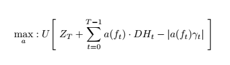
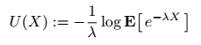

# Deep Hedging
## Reinforcement Learning for Hedging Derviatives under Market Frictions
### Beta version. Please report any issues. Please see installation support below.

This archive contains a sample implementation of of the [Deep Hedging framework](http://deep-hedging.com).
The notebook directory has a number of examples on how to use it. The framework relies on the pip package [cdxbasics](https://github.com/hansbuehler/cdxbasics).

The Deep Hedging problem for a horizon $T$ hedged over $M$ time steps with $N$ hedging instruments is given as

where $DH_t:=H_T - H_t$ denotes the vector of returns of the hedging instruments to $T$. In transaction cost are proportional with proportionality factor~$\gamma$.
The policy $a$ is a neural network which is fed both pre-computed and live features $f_t$ at each time step. The operator $U$ is a <i>monetary utility</i>. Think of it as a risk-adjusted return. A classic example is the entropy, given by

The code base supports a number of ulility-based monetary utilities which can be found in the
file <tt>objectives.py</tt>.

To test the code run <tt>notebooks/trainer.ipynb</tt>.

In order to run the Deep Hedging, we require:
<ol>
    <li><b>Market data</b>: this is referred to as a <tt>world</tt>. Among other members, world has a <tt>tf_data</tt> member which
        represents the feature sets across training samples, and <tt>tf_sample_weights</tt> which is the probability distribution
        across samples. The sample code provides a simplistic default world implementation, but for any real application it is recommend to rely
        on (fully machine learned market simulators)[https://arxiv.org/abs/2112.06823].
    </li>
    <li><b>Gym</b>: the main Keras custom model. It is a Monte Carlo loop arund the actual underlying <tt>agent.py</tt> networks which represents $a$ in the formula above. 
        Given a <tt>world</tt> object we may compute the loss given the prevailing action network as <tt>gym(world.tf_data)</tt>.
    </li>
    <li><b>Train</b>: some cosmetics around <tt>keras.fit()</tt> with some nice live visualization of our training progress using matplotlib if you 
        are in jupyter. See discussion below.
    </li>
</ol>

To provide your own world with real or simulator data, see <tt>world.py</tt>.
Here are <tt>world.tf_data</tt> entries used by <tt>gym.call()</tt>:
<ul>
<li>
<tt>data['market']['payoff']</tt> (:,)  
The payoff $Z_T$ at maturity. Since this is at or part the expiry of the product, this can be computed off the path until $T$.
 &nbsp;
</li>
<li>
<tt>data['martket']['hedges']</tt> (:,M,N) 
Returns of the hedges, i.e. the vector $DH_t:=H_T - H_t$. That means $H_t$ is the model price at time $t$, and $H_T$ is the price at time $T$. 
In most applications $T$ is chosen such that $H_T$
is the actual payoff. 
    For example, if $S_t$ is spot, $w_t$ is the implied volatility at $t$,  $T$ is time-to-maturity, and
    $k$ a relative strike, then $H_t = BSCall( S_t, w_t; T, kS_t )$ and $H_T = ( S_{t+T} / S_t - k )^+$.
 &nbsp;
</li>
<li>
<tt>data['martket']['cost']</tt> (:,M,N) 
Cost $\gamma_t$ of trading the hedges in $t$ for proportional cost $c_t(a) = \gamma_t\cdot |a|$. 
More advanced implementations allow to pass the cost function itself as a tensorflow model. 
    In the simple setting an example for the cost of trading a vanilla call could be $\gamma_t = \gamma^D\, \Delta(t,\cdots)+ \gamma^V\,BSVega(t,\cdots)$.
 &nbsp;
</li><li>
<tt>data['martket']['unbd_a'], data['martket']['lnbd_a']</tt> (:,M,N) 
Min/max allowed action per time step: $a^\min_t \leq a \leq a^\max_t$, componenwise.
 &nbsp;

</li><li>
<tt>data['features']['per_step']</tt> (:,M,N) 
Featues for feeding the action network per time step such as current spot, current implied volatilities, time of the day, etx
 &nbsp;
</li><li>
<tt>data['features']['per_sample']</tt> (:,M) 
Featues for feeding the action network which are constant along the path such as features of the payoff, risk aversion, 
</ul>

The code examples provided are fairly general and allow for a wide range of applications. 
An example world generator for simplistic model dynamics is provided, but in practise it is recommend to rely
on fully machine learned market simulators such as https://arxiv.org/abs/2112.06823

## Installation

<ul>
    <li>Use Python 3.7
    <li>Pip (or conda) install <tt>cdxbasics</tt> version 0.1.42 or higher
    <li>Install TensorFlow 2.7 or higher
    <li>Install tensorflow_probability 0.15 or higher
    <li>Download this git directory in your Python path such that <tt>import deephedging.world</tt> works.
    <li>Open <tt>notebooks/trainer.ipynb</tt> and run it. 
</ul>
See below for more comments on different Python versions, installation, on using AWS and GPUs.

## Industrial Machine Learning Code Philosophy

We attempted to provide a base for industrial code development.
<ul>
    <li>
        <b>Notebook-free</b>: all code can, and is meant to run 
        outside a jupyter notebook. Notebooks are good for playing around but should not feature in any production environment.
        Notebooks are used for demonstration only.
         &nbsp;
    </li>
    <li>    
        <b>Defensive programming</b>: validate as many inputs to functions as reasonable with clear, actionable, context-dependent 
        error messages. We use the <tt>cdxbasics.logger</tt> framework with a similar usage paradigm as C++ ASSSET/VERIFY.
         &nbsp;
    </li>
    <li>
    <b>Robust configs</b>: all configurations of all objects are driven by dictionaries.
    However, the use of simple dictionaries leads to a number of inefficiencies which can slow down development.
    We therefore use <tt>cdxbasics.config.Config</tt> which provides:
    <ul>
        <li><b>Catch Spelling Errors</b>: ensures that any config parameter is understood by the receving code. 
            That means if the code expects <tt>config['nSamples']</tt> but we passed <tt>config['samples']</tt>
            an error is thrown.
        </li>
        <li><b>Self-documentation</b>: once parsed by receving code, the config is self-documenting and is able
            to print out any values used, including those which were not set by the users when calling the receiving code.
            </li>
        <li><b>Object notation</b>: we prefer using <tt>config.nSamples = 2</tt> instead
            of the standard dictionary notation.
        </li>
        &nbsp;
    </ul>
    </li>
    <li>
        <b>Config-driven built</b>: 
        avoids differences between training and inference code. In both cases, the respective model hierarchy is built
        driven by the structure of the config file. There is no need to know for inference which sub-models where used during training within the overall model hierarchy.          
         &nbsp;
    </li>
</ul>

## Key Objects and Functions

<ul>
    <li><b>world.SimpleWorld_Spot_ATM</b> class 
         Simple World with one asset and one floating ATM option.
    The asset has stochastic volatility, and a mean-reverting drift.
    The implied volatility of the asset is not the realized volatility, allowing to re-create some results from https://arxiv.org/abs/2103.11948 
     
    Set the <tt>black_scholes</tt> boolean config flag to <tt>True</tt> to turn the world into a simple black & scholes world, with no traded option.
    Otherwise, use <tt>no_stoch_vol</tt> to turn off stochastic vol, and <tt>no_stoch_drift</tt> to turn off the stochastic mean reverting drift of the asset.
    If both are True, then the market is Black & Scholes, but the option can still be traded for hedging.
         
    See <tt>notebooks/simpleWorld_Spot_ATM.ipynb</tt>
       &nbsp;  
    </li>
    <li><b>gym.VanillaDeepHedgingGym</b> class 
        Main Deep Hedging training gym (the Monte Carlo). It will create internally the agent network and the monetary utility $U$.
         
        To run the models for all samples of a given <tt>world</tt> use <tt>r = gym(world.tf_data)</tt>. 
        The returned dictionary contains the following members
        <ol>
                 <li><tt>utility: </tt> (:,) primary objective to maximize
            </li><li><tt>utility0:</tt> (:,) objective without hedging
            </li><li><tt>loss:    </tt> (:,) -utility-utility0
            </li><li><tt>payoff:  </tt> (:,) terminal payoff 
            </li><li><tt>pnl:     </tt> (:,) mid-price pnl of trading (e.g. ex cost)
            </li><li><tt>cost:    </tt> (:,) cost of trading
            </li><li><tt>gains:   </tt> (:,) total gains: payoff + pnl - cost 
            </li><li><tt>actions: </tt> (:,M,N) actions, per step, per path
            </li><li><tt>deltas:  </tt> (:,M,N) deltas, per step, per path
            </li>
        </ol>
        See <tt>notebooks/trainer.ipynb</tt>.
    </li>
         
    The core engine in <tt>call()</tt> is not only about 200 lines of code. It is recommended to read it before using the framework.
       &nbsp;  
    </li>
    <li><b>trainer.train</b> function 
        Main Deep Hedging training engine (stochastic gradient descent).  
        Trains the model using Keras. Any optimizer supported by Keras might be used. When run in a Jupyer notebook the model will 
        dynamically plot progress in a number of live updating graphs.
    When training outside jupyer, set <tt>config.visual.monitor_type = "none"</tt> (or write your own).
     
        See <tt>notebooks/trainer.ipynb</tt>.
     
     
    The <tt>train()</tt> function is barely 50 lines. It is recommended to read it before using the framework.
    </li>
       
    
</ul>

## Interpreting Progress Graphs

Here is an example of progress information printed by  <tt>NotebookMonitor</tt>:

The graphs show:
<ul>
<li>(1): visualizing convergence
    <ul>
        <li>(1a): last 100 epochs loss view on convergence: initial loss, full training set loss with std error, batch loss, validation loss, and the running best fit.
        </li>
        <li>(1b): loss across all epochs, same metrics as above.
        </li>
        <li>(2c): last 100 epochs Monetary utility (value) of the payoff alone, and of the hedged gains (on full training set and on validation set).
        </li>
    </ul>
<li>(2) visualizing the result on the training set:
    <ul>
    <li>(2a) shows the payoff as function of terminal spot. That graph makes sense for terminal payoffs, but less so for full path dependent structures.
            Blue is the hedged position, orange the orignal position, and green the hedge.
    </li>
    <li>(2b) shows the cash (gains) by percentile. In the example we see that the original payoff has a better payoff profile for much of the x-axis, but a sharply larger loss otherwise.
    </li>
    <li>(2c) shows the utility by percentile. The farthest right is what is optimized for.
    </li>
    </ul>
</li>
<li>(3) same as (2), but for the validation set.
</li>
<li>(4) visualizes actions:
    <ul>
        <li>(4a) shows  actions per time step
        </li><li>
        (4b) shows the aggregated action as deltas accross time steps. Note that the concept of "delta"
only makes sense if the instrument is actually the same per time step, e.g. spot of an stock price. For floating options this is not a particularly 
            meaningful concept.
        </li>
    </ul>
</li>
    

## Running Deep Hedging

Copied from <tt>notebooks/trainer.ipynb</tt>:

        from cdxbasics.config import Config
        from deephedging.trainer import train
        from deephedging.gym import VanillaDeepHedgingGym
        from deephedging.world import SimpleWorld_Spot_ATM

        # see print of the config below for numerous options
        config = Config()
        # world
        config.world.samples = 10000
        config.world.steps = 20
        config.world.black_scholes = True
        # gym
        config.gym.objective.utility = "exp2"
        config.gym.objective.lmbda = 10.
        config.gym.agent.network.depth = 3
        config.gym.agent.network.activation = "softplus"
        # trainer
        config.trainer.train.batch_size = None
        config.trainer.train.epochs = 400
        config.trainer.train.run_eagerly = False
        config.trainer.visual.epoch_refresh = 1
        config.trainer.visual.time_refresh = 10
        config.trainer.visual.pcnt_lo = 0.25
        config.trainer.visual.pcnt_hi = 0.75

        # create world
        world  = SimpleWorld_Spot_ATM( config.world )
        val_world  = world.clone(samples=1000)

        # create training environment
        gym = VanillaDeepHedgingGym( config.gym )

        # create training environment
        train( gym=gym, world=world, val_world=val_world, config=config.trainer )

        # print information on all available parameters and their usage
        print("=========================================")
        print("Config usage report")
        print("=========================================")
        print( config.usage_report() )
        config.done()

## Config Parameters

This is the output of the <tt>print( config.usage_report() )</tt> call above. It provides a summary of all config values available, their defaults, and what values where used.

Here is an example. Please run the actual code for updated parameter descriptions

        config.gym.agent.network['activation'] = softplus # Network activation function; default: relu
        config.gym.agent.network['depth'] = 3 # Network depth; default: 3
        config.gym.agent.network['width'] = 20 # Network width; default: 20
        config.gym.agent['agent_type'] = feed_forward #  Default: feed_forward
        config.gym.agent['features'] = ['price', 'delta', 'time_left'] # Named features the agent uses from the environment; default: ['price', 'delta', 'time_left']

        config.gym.environment['softclip_hinge_softness'] = 1.0 # Specifies softness of bounding actions between lbnd_a and ubnd_a; default: 1.0

        config.gym.objective['lmbda'] = 10.0 # Risk aversion; default: 1.0
        config.gym.objective['utility'] = exp2 # Type of monetary utility: mean, exp, exp2, vicky, cvar, quad; default: entropy

        config.trainer.train['batch_size'] = None # Batch size; default: None
        config.trainer.train['epochs'] = 10 # Epochs; default: 100
        config.trainer.train['optimizer'] = adam # Optimizer; default: adam
        config.trainer.train['run_eagerly'] = False # Keras model run_eagerly; default: False
        config.trainer.train['time_out'] = None # Timeout in seconds. None for no timeout; default: None
        config.trainer.visual.fig['col_nums'] = 6 # Number of columbs; default: 6
        config.trainer.visual.fig['col_size'] = 5 # Plot size of a column; default: 5
        config.trainer.visual.fig['row_size'] = 5 # Plot size of a row; default: 5
        config.trainer.visual['bins'] = 200 # How many x to plot; default: 200
        config.trainer.visual['epoch_refresh'] = 1 # Epoch fefresh frequency for visualizations; default: 10
        config.trainer.visual['err_dev'] = 1.0 # How many standard errors to add to loss to assess best performance; default: 1.0
        config.trainer.visual['lookback_window'] = 30 # Lookback window for determining y min/max; default: 30
        config.trainer.visual['confidence_pcnt_hi'] = 0.75 # Upper percentile for confidence intervals; default: 0.5
        config.trainer.visual['confidence_pcnt_lo'] = 0.25 # Lower percentile for confidence intervals; default: 0.5
        config.trainer.visual['show_epochs'] = 100 # Maximum epochs displayed; default: 100
        config.trainer.visual['time_refresh'] = 10 # Time refresh interval for visualizations; default: 20

        config.world['black_scholes'] = True # Hard overwrite to use a black & scholes model with vol 'rvol' and drift 'drift; default: False
        config.world['corr_ms'] = 0.5 # Correlation between the asset and its mean; default: 0.5
        config.world['corr_vi'] = 0.8 # Correlation between the implied vol and the asset volatility; default: 0.8
        config.world['corr_vs'] = -0.7 # Correlation between the asset and its volatility; default: -0.7
        config.world['cost_p'] = 0.0005 # Trading cost for the option on top of delta and vega cost; default: 0.0005
        config.world['cost_s'] = 0.0002 # Trading cost spot; default: 0.0002
        config.world['cost_v'] = 0.02 # Trading cost vega; default: 0.02
        config.world['drift'] = 0.1 # Mean drift of the asset; default: 0.1
        config.world['drift_vol'] = 0.1 # Vol of the drift; default: 0.1
        config.world['dt'] = 0.02 # Time per timestep; default: One week (1/50)
        config.world['invar_steps'] = 5 # Number of steps ahead to sample from invariant distribution; default: 5
        config.world['ivol'] = 0.2 # Initial implied volatility; default: Same as realized vol
        config.world['lbnd_as'] = -5.0 # Lower bound for the number of shares traded at each time step; default: -5.0
        config.world['lbnd_av'] = -5.0 # Lower bound for the number of options traded at each time step; default: -5.0
        config.world['meanrev_drift'] = 1.0 # Mean reversion of the drift of the asset; default: 1.0
        config.world['meanrev_ivol'] = 0.1 # Mean reversion for implied vol vol vs initial level; default: 0.1
        config.world['meanrev_rvol'] = 2.0 # Mean reversion for realized vol vs implied vol; default: 2.0
        config.world['payoff'] = \<function SimpleWorld_Spot_ATM.__init__.\<locals\>.\<lambda\> at 0x0000022125590708\> # Payoff function. Parameters is spots[samples,steps+1]; default: Short ATM call function
        config.world['rcorr_vs'] = -0.5 # Residual correlation between the asset and its implied volatility; default: -0.5
        config.world['rvol'] = 0.2 # Initial realized volatility; default: 0.2
        config.world['samples'] = 10000 # Number of samples; default: 1000
        config.world['seed'] = 2312414312 # Random seed; default: 2312414312
        config.world['steps'] = 20 # Number of time steps; default: 10
        config.world['strike'] = 1.0 # Relative strike. Set to zero to turn off option; default: 1.0
        config.world['ttm_steps'] = 4 # Time to maturity of the option; in steps; default: 4
        config.world['ubnd_as'] = 5.0 # Upper bound for the number of shares traded at each time step; default: 5.0
        config.world['ubnd_av'] = 5.0 # Upper bound for the number of options traded at each time step; default: 5.0
        config.world['volvol_ivol'] = 0.5 # Vol of Vol for implied vol; default: 0.5
        config.world['volvol_rvol'] = 0.5 # Vol of Vol for realized vol; default: 0.5

## Misc Code Overview
    

<ul>
        <li>
    <tt>gym.py</tt> contains the gym for Deep Hedging, <tt>VanillaDeepHedgingGym</tt>. It is a small script and it is recommended that every user
    reads it.
    </li><li>    
    <tt>train.py</tt> simplistic wrapper around keras <tt>fit()</tt> to train the <tt>gym</tt>. It is a small script and it is recommended that every user
    reads it.
    </li><li>
        <tt>base.py</tt> contains a number of useful tensorflow utilities such as
        <ul>
                 <li><tt>tfCast, npCast</tt>: casting from and to tensorflow
            </li><li><tt>tf_back_flatten</tt>: flattens a tenosr while keeping the first 'dim'-1 axis the same.
            </li><li><tt>tf_make_dim</tt>: ensures a tensor has a given dimension, by either flattening it at the end, or adding <tt>tf.newaxis</tt>.
            </li><li><tt>mean, var, std, err</tt>: standard statistics, weighted by a density.
            </li><li><tt>mean_bins</tt>: binning by taking the average.
            </li><li><tt>mean_cum_bins</tt>: cummulative binning by taking the average.
            </li><li><tt>perct_exp</tt>: CVaR, i.e. the expecation over a percentile.
            </li><li><tt>fmt_seconds</tt>: format for seconds.
            </li>
        </ul>
    </li><li>
        <tt>world.py</tt> contains a world generator <tt>SimpleWorld_Spot_ATM</tt>.
    </li><li>
    <tt>agents.py</tt> contains an <tt>AgentFactory</tt> which is creates agents on the fly from a <tt>config</tt>.
        Only implementation provided is a simple <tt>FeedForwardAgent</tt>. Typically driven by top level <tt>config.gym.agent</tt>.
        Is also used by <tt>objectives.py</tt>.
    </li><li>
    <tt>objectives.py</tt> contains an <tt>MonetaryUtility</tt> which implements a range reasonable objectives.
    Typically driven by top level <tt>config.gym.objective</tt>.
    </li><li>
    <tt>plot_training.py</tt> contains code to provide live plots during training when running in a notebook.
    </li>
</ul>

# Installation Support

### TensorFlow and Python

Deep Hedging was developed using Tensorflow 2.7 on Python 37. The latest version seems to run with TF 2.6 on Python 3.6 as well. Check version compatibility between TensorFlow and Python [here](https://www.tensorflow.org/install/source#cpu). The main difference is that TF before 2.7 expects tensors of dimension (nBatch)
to be passed as (nBatch,1).

Deep Hedging uses tensorflow-probability which does <i>not</i> provide a robust dependency to the installed tensorflow version. If you receive an error you will need to make sure manually that it matches to your tensorflow version [here](https://github.com/tensorflow/probability/releases).

In your local environment:
        
        pip install cdxbasics "tensorflow>=2.7" "tensorflow-gpu>=2.7" tensorflow_probability==0.14
        
Here is a stub which you may want to put ahead of any notebook you use (*)
                
        import tensorflow as tf
        import tensorflow_probability as tfp # ensure this does not fail
        print("TF version %s. Num GPUs Available: %ld" % (tf.__version__, len(tf.config.list_physical_devices('GPU')) ))
        
### GPU

In order to run on GPU you must have installed the correct CUDA and cuDNN drivers, see [here](https://www.tensorflow.org/install/source#gpu).
Once you have identified the correct drivers, use

        conda install -c conda-forge cudatoolkit=11.2 cudnn=8.1
        
Run the code above (*) to check whether it picked up your GPU. Make sure you have one on the instance you are working on.
<i>Note that Deep Hedging does not benefit much from GPU use.</i>

### AWS SageMaker

At the time of writing AWS SageMaker does not support TF 2.7. Moreover, it does not support GPUs for TF above 2.3.
For using 2.6 without GPUs which is faster than 2.3 with GPUs, create a new instance and select the <tt>conda_tensorflow2_p36</tt> enviroment.

In a terminal type
        
        bash
        conda activate tensorflow2_p36
        pip install cdxbasics "tensorflow>=2.6" "tensorflow-gpu>=2.6" tensorflow_probability==0.14 
                
If you have cloned the [Deep Hedging git directory](https://github.com/hansbuehler/deephedging) via SageMaker, then the <tt>deephedging</tt> directory is <i>not</i> in your include path, even if the directory shows up in your jupyter hub file list. You will need to add the path of your cloned git directory to python import. 
        
A simple method is to add the following in a cell ahead of the remaining code, e.g. at the beginning of <tt>notebooks/trainer.ipynb</tt>

        import os
        p = os.getcwd()
        end = "/deephedging/notebooks"
        assert p[-len(end):] == end, "*** Error: expected current working directory to end with %s but it is %s" % (end,p)
        p = p[:-len(end)]
        import sys
        sys.path.append(p)
        print("Added python path %s" % p)

